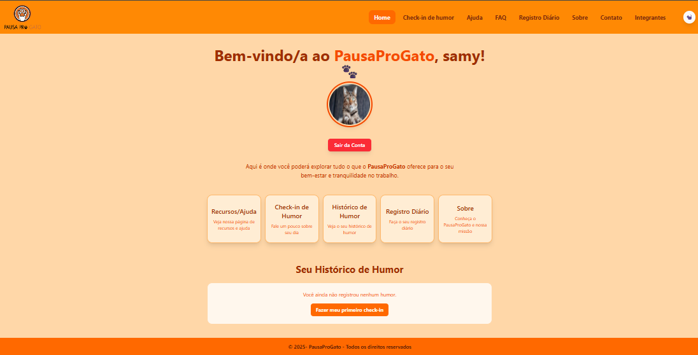
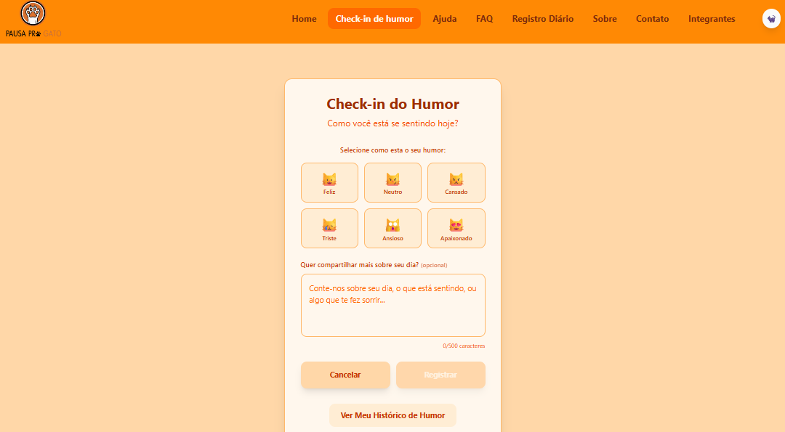
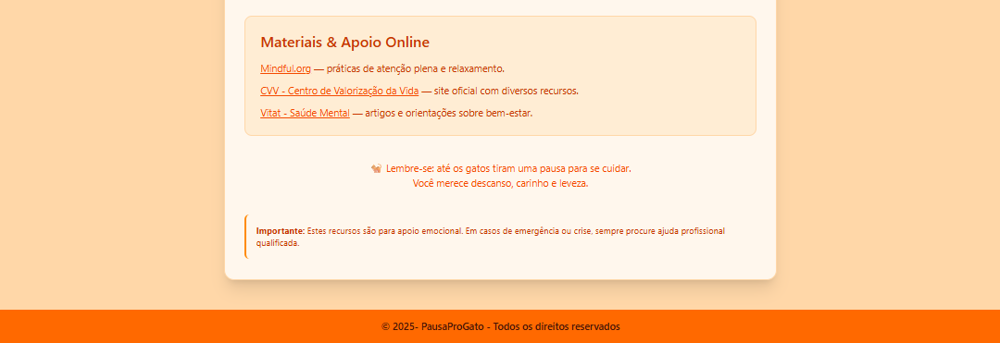
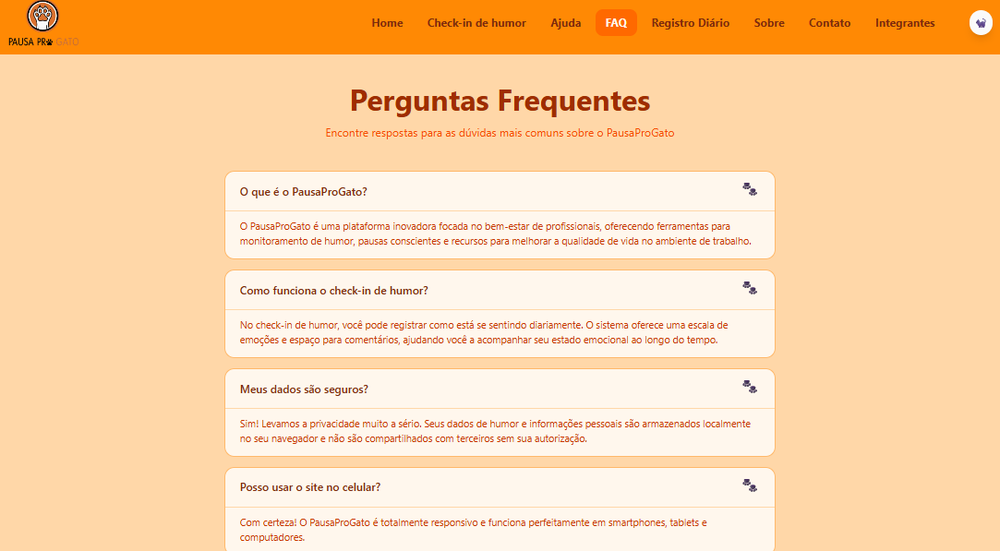

# PausaProGato

## Descrição

O PausaProGato nasceu com o propósito de trazer leveza, autocuidado e bem-estar para o dia a dia de quem vive a rotina intensa do trabalho.

## Sumário

- [Endereço Organização](#endereço-organização)
- [Sobre o Projeto](#sobre-o-projeto)
- [Status do Projeto](#status-do-projeto)
- [Tecnologias Utilizadas](#tecnologias-utilizadas)
- [Instalação](#instalação)
- [Como Usar](#como-usar)
- [Estrutura de Pastas e Arquivos](#estrutura-de-pastas-e-arquivos)
- [Endpoints](#endpoints)
- [Autores e Créditos](#autores-e-créditos)
- [Screenshots](#screenshots)
- [Contato](#contato)
- [Enderço do projeto na Vercel](#enderço-do-projeto-na-vercel)
- [Link do Vídeo no Youtube](#link-do-vídeo-no-youtube)
- [Endereço repositório do projeto do GITHUB](#endereço-repositório-do-projeto-do-github)

## Endereço da Organização

Endereço Organização GITHUB: https://github.com/PausaProGato

## Sobre o Projeto
 Inspirado na ideia de que pequenas pausas podem transformar o humor e a produtividade, a plataforma utiliza o carisma e a alegria dos gatinhos para incentivar momentos de relaxamento e atenção à saúde mental no ambiente profissional.

A plataforma permite aos usuários:
- Realizar check-in emocional:
  - Os colaboradores registram diariamente seu estado emocional, criando um histórico pessoal de humor e saúde mental.

- Registrar o humor do dia:
  - Cada usuário pode sinalizar como está se sentindo, facilitando o autoconhecimento e a identificação de padrões de bem-estar e possíveis sinais de cansaço, ansiedade ou estresse.

- Acessar recursos de apoio:
  - São disponibilizadas dicas, mensagens de acolhimento e sugestões de autocuidado, principalmente para quem está enfrentando momentos difíceis durante o expediente ou fora dele.

- Promover a cultura da pausa saudável:
  - O sistema incentiva pausas curtas e conscientes ao longo do dia, mostrando que interromper a rotina para cuidar da mente é fundamental para a produtividade e para o clima organizacional.

- Valorizar o autocuidado com leveza:
  - O projeto reforça, diariamente, que cuidar de si é essencial e transformar esse momento em algo lúdico e gentil faz toda diferença.
  
Mais do que uma ferramenta, o PausaProGato é um convite à coragem de pausar, sendo uma verdadeira fonte de apoio ao bem-estar e à saúde mental de equipes e indivíduos. Seu desenvolvimento foi inspirado em pesquisas atuais sobre saúde emocional no trabalho e nas melhores práticas de acolhimento, promovendo um espaço digital seguro, amigável e acolhedor para todos.

## Status do Projeto

- Finalizado

## Tecnologias Utilizadas

    Front-End

    Vite: Bundler rápido para desenvolvimento front-end.
    React: Biblioteca para construção da interface.
    TypeScript: Superset do JavaScript com tipagem estática.
    TailwindCSS: Framework de estilização utilitária.

    Back-End e Integrações

    - Java + Quarkus: API RESTful que fornece os dados e gerencia as operações do sistema.
    - Banco de Dados: Integração com o banco de dados relacional.
    - Hospedagem Remota: A API Java foi hospedada remotamente na plataforma Render, que oferece deploy e gerenciamento fácil de serviços web.
    - Fetch API: Utilizado no front-end para comunicação com a API Java.
    - API RESTful: Define endpoints para operações como criação, leitura, atualização e exclusão das informações do formulário. 

## Instalação

Siga os passos abaixo paar preparar o ambiente e rodar o projeto:

1. Clone o repositório
2. Navegue até a pasta do projeto
3. Instale as dependências:
    - npm install
4. Execute o projeto:
    - npm run dev

## Como usar

1. No React/Vite:
  - Depois do Npm Run Dev, clique no link fornecido
  (geralmente http://localhost:5173)
  - O link te levará até o nosso site
  - Faça o Login no site e aproveite nossas funcionalidades

2. No Vercel:
  - Aqui no README está presente o link do Vercel
  - Clique nele e ele o direcionará ao nosso site
  - Faça o Login no site e aproveite nossas funcionalidades

## Estrutura de pastas e arquivos

    projeto
        public/
            img/
              imagens em png e jpeg
            img_README
              imagens em png
            src/
                componentes/
                    BotaoTema/
                        arquivo tsx
                    Cabecalho/
                        arquivo tsx
                    Footer/
                        arquivo tsx
                context/
                    arquivos tsx
                pages/
                    Check-inHumor/
                        arquivo tsx
                    Contato/
                        arquivo tsx
                    DetalhesHumor/
                        arquivo tsx
                    Faq/
                        arquivo tsx
                    HistoricoHumor/
                        arquivo tsx
                    Home/
                        arquivo tsx
                    Integrantes/
                        arquivo tsx
                    Login/
                        arquivo tsx
                    Recursos/
                        arquivo tsx
                    RegistroDiario/
                        arquivo tsx
                    Sobre/
                        arquivo tsx
                App.tsx 
                index.css
                main.tsx
            eslint.config.js
            index.html
            package.json
            package-lock.json
            .gitignore
            tailwind.config.js
            tsconfig.app.json
            tsconfig.json
            tsconfig.node.json
            vercel.json
            vite.config.ts

## Endpoints

    <Routes>
        <Route path="/" element={<Login />} />
        <Route path="/home" element={<Home />} />
        <Route path="/faq" element={<FAQ />} />
        <Route path="/integrantes" element={<Integrantes />} />
        <Route path="/sobre" element={<Sobre />} />
        <Route path="/humor/checkin" element={<Humor />} />
        <Route path="/humor/checkin/:timestamp" element={<Humor />} />
        <Route path="/humor/detalhes/:timestamp" element={<HumorDetalhes />} />
        <Route path="/humor/historico" element={<HumorHistorico />} />
        <Route path="/humor/historico/:periodo" element={<HumorHistorico />} />
        <Route path="/registro" element={<RegistroDiarioPage />} />
        <Route path="/recursos" element={<RecursosAjuda />} />
        <Route path="/contato" element={<Contato />} />
      </Routes>

## Screenshots

- Aqui o usuário faz o login

- Aqui o usuário vê uma mensagem de boas vindas antes de entrar no site

- Aqui o usuário tem acesso a todas as funcionalidades do site e ao histórico de humor

- Aqui tem a página de check-in do humor onde o usuário compartilha como está o seu humor

- Aqui o usuário tem acesso a página de ajuda onde contém dicas de bem-estar, apoio emocional, materiais e outros

- Aqui o usuário encontra perguntas frequentes sobre o site, check-in, dados e outros

- Aqui o usuário encontra um formulário de registro diário, onde ele informa sobre seu humor, estresse, pausas e exercicios

- Aqui o usuário encontra informações sobre o site

- Aqui o usuário encontra um formulário para entrar em contato com a gente

- Aqui o usuário encontra informações dos integrantes do grupo

## Autores e Créditos

    Nome:
        Samantha Faruolo Galdi/RM554794
        GITHUB: https://github.com/samyfg41
        Ana Claudia Fernandes Martins/RM561190
        GITHUB: https://github.com/AnaCFmartins
        Agatha Yie Won Yun/RM561507
        GITHUB: https://github.com/agathayun

## Contato

- Linkedin: https://www.linkedin.com/in/samantha-faruolo-galdi-534422301/

- Linkedin: https://www.linkedin.com/in/agatha-yun-75334535b/

- Linkedin: https://www.linkedin.com/in/ana-claudia-fernandes-martins/

## Endereço repositório do projeto do GITHUB

Endereço GITHUB: https://github.com/PausaProGato/PausaProGato.git

## Enderço do projeto na Vercel

Link: https://pausa-pro-gato.vercel.app

## Link do Vídeo no Youtube

Link: https://youtu.be/O5xAAWQzjmc?si=f-Q_XmGDs15Gh2X_

## Formatação arquivo MARKDOWN (*.MD)
https://support.zendesk.com/hc/pt-br/articles/4408846544922-Formata%C3%A7%C3%A3o-de-texto-com-Markdown?page=1&sort_by=created_at&sort_order=desc   
